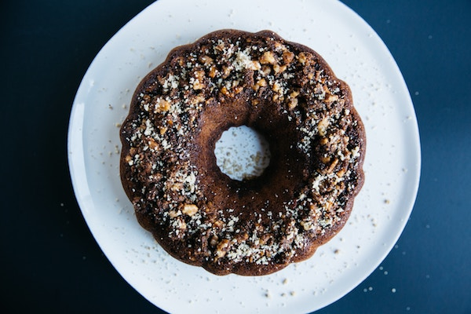

# Hello, world

### The following header is the blog's description

## A test blog

There's a few things to test for with this package. One critical test is for finding images, like these:

The title of this blog can be extracted from the top level header and the description from the following second level header.

But tags need to be provided explicitly. To do this we can take advantage of _references_.

[tags]: hello,world

Note that there cannot be any whitespace or the reference breaks.

# Having multiple top level headers is bad form

## But should still test for them

[tags]: more-tags

Images that are repeated should all point to the same optimized and processed version. I don't know why a blog entry would have the same image displayed more than once, but you never know.

While we're at it, hot linked photos should not be processed at all.

